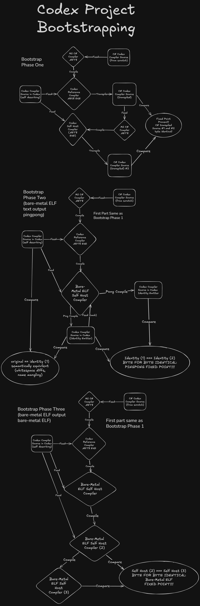

# Codex

**The first self-sustaining compiler.**

A *self-sustaining compiler* is a single artifact that, on its own,
runs on bare metal, takes its own source as input, and produces another
instance of itself — with no external host, no separate operating system,
no runtime to install. The compiler *is* the runtime. The compiler *is*
the OS. They are not two things cohabiting; they are one entity.

The operational test:

> Hand me the compiler artifact. Nothing else. Can I do anything with it?

| Artifact | Can I do anything with just this? |
|---|---|
| gcc / rust / ghc / ocaml | **No.** Need Linux/macOS/Windows. |
| HolyC binary (TempleOS) | **No.** Need TempleOS underneath. |
| Oberon compiler | **No.** Need the Oberon System. |
| Lisp Machine compiler | **No.** Need the Lisp Machine environment. |
| Forth interpreter | I can run Forth code, but it can't reproduce itself. |
| **Codex.cdx** | **Yes.** Boot it. Compile its own source. Get another copy of itself. |
| **Codex.img** | **Yes.** Write it to a USB stick. Put it in your computer. It runs. |

That property — *the artifact alone is sufficient* — has not been
achieved by any prior compiler. Self-hosting (the compiler can compile
itself) has been done thousands of times. Self-sustainment of a *system*
(TempleOS, Native Oberon, Lisp Machines) has been done a handful of
times — but in each case the compiler is one component within an
operating system, not the whole. Codex collapses that distinction. The
compiler-as-binary *is* the OS, not because they're packaged together,
but because there is no internal seam between them.

Built solo by one human in collaboration with a fleet of AI agents, in
41 days (2026-03-14 → 2026-04-24).

---

## Verified

As of 2026-06-28:

- **CDX fixed point**: pingpong all phases green — text round-trip
  (stage1 === stage2) + CDX fixed-point (stage1.cdx === stage2.cdx),
  byte-identical. The compiler reproduces itself on bare metal.
- **507 library modules** (360 foreword + 147 OS) across 28 quires: data structures, crypto,
  networking (full TCP/IP + UDP/ICMP/DNS/DHCP/NTP/Syslog/TFTP), game
  engine (A*, hex maps, ECS, physics, Voronoi, Perlin), 3D engine
  (renderer, scene graph, LOD, culling, materials, skinning, audio,
  input, post-processing), AI inference (tensors, neural nets, GGUF
  model loading, genetic algorithms), encoding (JSON, Base64, Protobuf,
  CSV), math (quaternions, matrices, Bezier, FFT), compression (LZ77,
  Huffman, RLE), UI toolkit (themeable widgets, compositor, layout engine,
  event system, orchestrator), hard real-time primitives (punctual integer,
  bit, saturating, trig, color, and kinematic ops), and more.
- **OS stack**: preemptive scheduler, IPC channels, identity (Ed25519),
  trust lattice, 5-phase CDX verifier, interactive shell, VGA console,
  developer debugger, HTTP server, process management, UEFI boot path,
  diagnostic shell.
- **GUI OS**: graphical operating system shell on bare metal via GOP
  framebuffer. GuiShell compositor with sidebar launcher, status bar,
  RTC clock. Resolution support: 640x480, 800x600, 1024x768 (32-bit
  XRGB8888). Multi-monitor management (extended, mirror, single modes)
  with default 1920x1080. Working apps: Calculator, Calendar, Notepad,
  Timer, Diffusion, Tracker, Piano. MutWheel scheduler for mutable GUI
  state via peek/poke (no GC, no closures). SMP-aware: work-stealing
  scheduler drives app rendering across cores.
- **UI foreword**: 28-chapter toolkit with themeable primitives
  (swap one Theme record to get LCARS, cockpit, or terminal look),
  flex layout, compositor with z-order and alpha blending, event dispatch,
  reactive bindings, animations/throbbers, multi-size bitmap icons,
  TrueType font rendering (14 CC0 fonts, 4x4 AA rasterizer), overlays,
  sound effects, and a central orchestrator loop.
- **Agent lifecycle**: local AI runtime (GGUF loader, inference),
  agent acquisition (bundled/USB/network, verification), coordinator
  (local/upstream escalation, role dispatch), first-boot wizard.
- **GPU compute**: dual-target compilation via plugs — PTX (NVIDIA) and
  SPIR-V (Vulkan/OpenCL) plugs built and compiling (157KB/152KB CDX).
  Shared-memory proxy protocol for host-side dispatch. Device IR
  emission from compiler; plugs parse IR and emit target format.
  Kernels K5-K8 complete: warp primitives, shared memory, atomics,
  math intrinsics, and a kernel verifier. New `codex.foreword.gpu`
  quire (10 modules). End-to-end vecadd test passes.
  Design: `docs/Designs/Backends/Active/DualTargetGpuCompilation.md`.
- **SMP (symmetric multiprocessing)**: all 5 phases complete for x86-64
  — atomics (lock-prefixed CAS/XADD/XCHG), per-core bootstrap (AP
  startup via SIPI), work-stealing scheduler, per-core heap isolation,
  and IPI + lock-free channels for cross-core communication. codex-vm
  supports `-smp N` flag for multi-core guests.
- **Cross-architecture test parity**: ARM64 135/135 and RISC-V 135/135
  verified tests on Renode (Cortex-A53 / RV64GC cycle-accurate simulation)
  -- 100% match with the x86-64 battery on both. Tests cover arithmetic,
  crypto, collections, TrueType font rendering, HTTP request/response
  parsing, effect handlers, pattern matching, closures, vectors, mutable
  records, and all foreword modules. Full battery:
  `build/test-cross-batch.ps1 -Arch arm64 -Jobs 4 -RenoTimeout 10`.
- **Signed CDX seed**: Ed25519-signed, self-verified, UEFI-bootable
  GPT disk image.
- **VMX hypervisor**: codex-vm.exe (WHP-based VM host), DevHypervisor,
  VmSerial, VmIde — Codex can host and manage virtual machines.
- **UEFI dev console**: interactive colored menus via ConOut/ConIn,
  source tree indexing, keyboard navigation. Hold Escape at UEFI boot.
- **Resilient act blocks**: `trying N times … falling back to … on
  failure … end` — retry loops with bivy-reclaim between attempts,
  optional fallback path, and explicit failure handler. New `fail`
  builtin sets a flag the body's tail checks.
- **Plug architecture**: emitters as standalone CDX programs. Compiler
  emits IR text; plug consumes IR via file I/O, emits target source.
  **52 plugs (all building clean)** -- across languages (Ada, Babbage, C#,
  Clojure, COBOL, D, Elixir, Fortran, Go, Groovy, Haskell, Java,
  JavaScript, Julia, Kotlin, Lua, Nim, Objective-C, OCaml, Pascal,
  Perl, PHP, Python, Ruby, Rust, Scala, Scheme, Swift, TypeScript,
  WASM, Zig), UI frameworks (Angular, Electron, Flutter, GTK, HTML,
  Jetpack Compose, MAUI, Qt, React, Svelte, SwiftUI, Vue, WinForms,
  WPF), GPU (PTX, SPIR-V), and binary formats (CDX, ELF, PE, IMG).
  Port forwarding in codex-vm enables host-to-guest TCP for plug data
  exchange.
- **SIMD / Vector types**: `Vector N T` as a first-class type with
  dependent lane count. SSE2 packed codegen (ADDPD, SUBPD, MULPD,
  DIVPD, CMPPD, MOVUPD). Vector arithmetic operators (`+`, `-`, `*`, `/`)
  and comparison operators (`<`, `>`, `<=`, `>=`) overloaded for vectors.
  `vec-splat`, `vec-extract`, `vec-reduce-add`, `vec-select` builtins.
  `VectorTy(N, T)` and `VectorMaskTy(N)` type constructors in the type
  checker; mismatched widths are type errors. Bounded integers in vector
  lanes.
  Design: `docs/Designs/Features/Active/SIMD.md`.
- **Real type + approximate equality**: `Number` renamed to `Real`.
  The `~` operator provides approximate equality (4 ULP default),
  `~0` for bitwise exact. `==` and `/=` on Real types are compile
  errors (CDX2085). Safety modes: `Real trapping`, `Real saturating`,
  `Real checked`. `Real approximate` (f32) for SIMD lane density.
- **Game engine foreword**: 21-chapter `codex.foreword.engine` quire
  — Renderer3D, Scene3D, Material, Texture, Mesh, Skinning, LOD,
  Culling, PostProcess, Audio3D, AudioBus, Input, GameLoop, GameplayTags,
  AbilitySystem, Signal, DebugDraw, TimeOfDay, AssetTable, EdgeMesh,
  HelmBridge.
- **Punctual foreword**: 8-chapter `codex.foreword.punctual` quire —
  IntOps, BitOps, Saturate, FastMath, Trig, ColorOps, Kinematic, Endian.
  Every function is `punctual`: no heap, no recursion, bounded instruction
  count. Safe for real-time, embedded, and interrupt contexts.
- **Dependent types**: `PropEqTy` — the first type carrying value
  information. `===` in type position produces propositional equality;
  `Refl` verified by the unifier (invalid proofs are type errors).
  `Proof` as first-class type name. Proof erasure at emit (zero machine
  code for proof definitions). `claim`/`proof` parser with `induction`
  keyword. Proof builtins: Refl, sym, trans, cong, assume.
- **Static bounds prover**: compiler proves bounded-integer range safety
  at compile time and elides runtime bounds checks (CDX4010). Handles
  literals, field access, int-mod, bit-and, negation. O(1) shallow
  analysis per narrow store (10x compile speedup over prior deep walker).
- **Lazy evaluation with memoization**: `lazy` keyword defers computation;
  `force` builtin evaluates the thunk. Memoizing cell ensures the body
  executes at most once. Desugars to a closure over a mutable cell with
  done-flag check.
- **Type classes (phase 1-2)**: `class`/`instance` keywords, dictionary-
  passing desugaring. `class Show where show : Integer -> Text` generates
  `ShowDict` record type; `instance Show Integer` generates a dict
  constructor and per-instance specialized methods (`show-Integer`).
- **Escape invariant (CDX9003)**: seal-time scan of deck pointers for
  bivy references. Compile with `-EscapeCheck` to detect deck-to-bivy
  violations before phase-compact reclaims bivy scratch. PARSE and SCOPE
  compact disabled pending violation fixes (127K violations identified).
- **Configurable surveys**: phase deck multipliers in `BuildSettings.codex`
  (no longer hardcoded in opening.codex). Deck overflow is a warning, not
  an error --- compilation continues. `compile.ps1` auto-retries with 4 GB
  on VM crash.
- **Deck overflow guard**: all 8 compiler phases (LEX, PARSE, DESUGAR,
  SCOPE, CHECK, LOWER, RESOLVE, LIFT) detect when deck allocation
  exceeds its survey budget and emit CDX9002 as a warning.
- **Fuzz corpus**: 44 adversarial inputs (binary garbage, huge
  identifiers, deep nesting, unclosed syntax, 100KB lines, recursive
  types, keyword abuse) — 0 crashes.
- **Punctual functions (hard real-time)**: `punctual` keyword enforces
  bounded execution at compile time. No heap (CDX6002), no recursion
  (CDX6005), no unsafe calls (CDX6001), no closures (CDX6003), no bare
  I/O (CDX6004). Instruction count reported at CDX6010; optional budget
  with CDX6011 warning. No production language has this combination --
  Ada Ravenscar is global and needs external WCET tools; Rust has nothing;
  MISRA-C is external linters. See `docs/Designs/OS/Active/HardRealtime.md`.
- **Unit types**: `Second = unit Integer` declares a distinct type with
  zero runtime overhead (erased at codegen). Arithmetic preserves units
  (`Second + Second = Second`, `Second * Integer = Second`). Cross-unit
  assignment is a type error. Bounded + unit composition
  (`Second between 0 and 3600`). Conversion declarations parsed
  (`1 Minute = 60 Second`).
- **Mutable records**: `mutable` keyword with in-place field
  assignment, type-checked immutability enforcement (CDX2060).
- **Repository restructure**: 31 top-level dirs to 8. codex-vm
  replaces QEMU as default VM (WHP-based, ~4500 lines C: PCI, xHCI USB,
  Intel HDA audio, HPET, IOAPIC, ACPI, SMBIOS, UEFI firmware, Bochs VBE).
- **Tuples**: `(A, B)` sugar in type position, `let (x, y) = e`
  destructuring. Desugars to foreword `Tup2`..`Tup5`; all 15 transpiler
  plugs emit idiomatic tuple syntax for their target language.
- **Scoped constraint dispatch**: `show`/`compare` inside class-
  constrained functions dispatches through the dictionary only for
  parameter-typed arguments; let-bound locals use direct dispatch.
- **C# plug full-compiler emit**: the emitted full compiler (2376 defs)
  now compiles under `dotnet build` with 0 errors.
- **Durable disk writes**: codex-vm IDE WRITE SECTORS + flush to host
  image file. Accounts and SystemDb persist across restarts.
- **Interactive debugger**: `-debug -break <fn> -map <file>` with
  command shell, guest `!EXC=03` serial interception, symbol resolution,
  conditional breakpoints.
- **For-expressions**: `for x in xs do f x` syntactic sugar for map
  loops. Desugars to `list-map` with a lambda. Dogfooded across ~50
  call sites in 19 files.
- **Sample battery**: 137 smoke tests (consolidated from 232 individual
  tests); 127 pass, 0 fail (10 skipped: fatal or platform-specific) --
  run against stage1, the self-applied compiler. BVT mode: 10-test
  subset, full build in ~113s.
- **Native-class codegen**: three parallel optimization campaigns across
  x86-64, ARM64, and RISC-V. 8 micro-benchmarks (fib, fact, gcd, sum,
  ack, tak, collatz, locals). ARM64: 176 insns total, beats GCC -Os by
  24%. RISC-V: 141 insns total, gcd matches GCC -Os exactly. x86-64:
  205 insns total, sum-to-N at 14 instructions (below C /O2 at 23),
  fact at 13 (below C /O2 at 15).
  Key techniques: destination-driven emission, TCO with dependency
  analysis, pow2 strength reduction, peephole MOV/NOP compaction,
  dead-branch elimination, frame elision, IrRemInt.
- **ERP suite**: 23 modules -- GL/AP/AR/Materials/HR/Treasury/
  Controlling/Sales/Production/Maintenance/Quality/Warehouse/Projects/
  BW plus Real Estate, Banking, Insurance, Utilities, and Healthcare
  verticals.
- **60 apps (27/27 web apps building clean)** -- see Applications below.
- **Codex.Spark creative suite**: 85-module application (3D modeling,
  image editor, animation, audio/DAW, video compositor, skeletal
  animation, particles, procedural noise, interactive UI shell) running
  on bare metal with GOP framebuffer display via codex-vm.
- **Codex.DB**: relational database server (42 modules). Typed schemas,
  pipe-forward queries (`RelScan |> RelFilter |> RelSort |> query`),
  MVCC transactions, WAL, B-tree indexes, hash joins, full-text search,
  replication, graph store, column store, time series, spatial indexes.
- **SystemDb**: on-device persistent store (DiskFacts format) for
  identity, boot config, trust vouches, and drive registry. Lives on
  the boot stick as `CODEX/SYSDB.BIN`.
- **CodexMagic game server**: 56 game modules with web portal.
- **Codex Circuits**: interactive EDA suite on bare metal. GPU
  rasterizer at ~950 FPS (8500+ triangles/frame), mouse panning,
  keyboard zoom, toolbar/sidebar chrome, demo circuit.
- **Explorer app**: 17-module parameter explorer with web UI (card
  designer, character designer, item designer, settings editor,
  workflow exporter). CDX server + PS1 bridge + HTML/JS frontend.

The compiler is a hard fixed point of itself on bare metal.

**`seed/Codex.cdx`** (1,921,384 bytes, ~1.83 MB) — the canonical seed:

| Algorithm | Digest |
|---|---|
| Content hash prefix | `A403ED8A` |
| SHA-256 | `AA8807CEB49104FAE571C618372ACE83717AFAE97E3AE57AB2EE2AF328FC018F` |

The seed shrank ~2.31 MB to ~1.83 MB on 2026-06-29 — the first rebuild
since June 21 captured the accumulated x86-64 codegen campaign (Val's
optimization CLs plus in-place binary folds and a TCO spill-to-register
move). Pure density: the function count actually rose and zero functions
were dropped (verified against the prior codegen of identical source),
so the smaller binary is the same compiler emitting tighter code.

**`seed/Codex.img`** (8,388,608 bytes) — bootable GPT disk image:

| Algorithm | Digest |
|---|---|
| SHA-256 | `83E76CC16C326BDEA9F792EE87FE9E3F28360A0BFB645DE57918F5F5DFA2DC2A` |

The IMG contains `EFI/BOOT/BOOTX64.EFI` (interactive UEFI dev console as a
UEFI PE32+ application) and `SOURCE.SRC` (compiler source) in an 8 MB
FAT16 GPT image. Colored menu with keyboard navigation, live RTC clock,
system info screen. Tested on real Asus TUF hardware and codex-vm (auto-
extracts PE from GPT, no manual extraction needed).

Flash to USB (requires elevated PowerShell):

```powershell
# Find your USB disk number:  Get-Disk | Where-Object BusType -eq USB
tools\write-usb.ps1 -Image seed\Codex.img -DiskNumber <N>
```

---

## Why

Most software is built on borrowed trust — someone else's OS, someone
else's runtime, someone else's certificate authority. Every dependency
is an assumption you can't verify. Codex is the project that stops
assuming.

- **Single-artifact substrate.** Boot `Codex.cdx`. There is no
  layer beneath it that you didn't compile yourself.
- **Literate by design.** Chapters and Sections aren't comments. They're
  structure. The compiler parses prose alongside code.
- **Own character encoding.** CCE (Codex Character Encoding) is
  frequency-sorted: `is-letter` is one comparison, not a table lookup.
  Unicode only at I/O boundaries.
- **Multiple backends.** The same compiler can target managed runtimes
  (C#, IL, JavaScript, Wasm) and native code (x86-64 bare metal, CDX).
  The bare-metal target is the perf and trust target; the others are
  ergonomic.
- **Algebraic effects.** Side effects are declared in types and handled
  explicitly. No surprise mutations.
- **Capability model.** Trust lattice, direction markers, and scoped
  capabilities designed in from the substrate, not bolted on after.

```codex
Chapter: Greeting
  cites Foreword chapter Console

  A small program that greets the user by name. The opening declares
  [Console] in its type — the effect is part of the contract, not a
  surprise that happens at runtime.

Section: Functions

  greet : Text -> Text
  greet (name) = "Hello, " & name & "!"

  opening : [Console] Nothing = act
    print-line "What is your name?"
    name <- read-line
    print-line (greet name)
  end

Page 1
```

---

## Quick Start

**Prerequisites**: `codex-vm.exe` (build via `tools/build-vm.ps1`) or
QEMU (with WHPX) for the bare-metal path.

```powershell
# Sample battery (bare-metal selfhost, ~2-5s per sample; -Jobs N for parallel)
build/test.ps1 -Jobs 4

# Full build: text round-trip + CDX fixed-point + test battery
build/build.ps1
```

### Try it without building (just codex-vm + the seed CDX)

The CDX in `seed/Codex.cdx` is a complete compiler. Boot it under
codex-vm, feed it source via a file, and it hands back CDX or
Codex-text — the output format is selected by the mode line.
Container formats (ELF, PE, GPT/FAT images) are produced by plug
CDX binaries in `codex/plugs/`. The `compile.ps1` helper wraps
the protocol:

```powershell
# Stage the seed where the helper expects it.
New-Item -ItemType Directory -Force build-output/bare-metal
Copy-Item seed/Codex.cdx build-output/bare-metal/Codex.cdx

# Compile a sample (boots codex-vm, loads source into guest memory, captures output).
build/compile.ps1 -Src codex/test/arithmetic.codex -Out build-output/arith.cdx -Log build-output/arith.log

# Boot the compiled program and capture its output.
build/test-run.ps1 -Kernel build-output/arith.cdx -OutFile build-output/arith.out
Get-Content build-output/arith.out
```

Memory-mapped I/O: source is pre-loaded into the guest ring buffer
at boot; output is captured from guest UART writes. No TCP sockets.

---

## Language Examples

The following is real Codex source — the same syntax the compiler parses.

```codex
Chapter: Feature Tour
  cites Foreword chapter Console

Section: Sum Types

  Shape =
    | Circle (Integer)
    | Rectangle (Integer) (Integer)

Section: Records

  Person = record {
    name : Text,
    age : Integer
  }

Section: Mutable Records

  mutable Counter = record {
    value : Integer
  }

  increment : Counter -> Counter
  increment (c) =
    c.value = c.value + 1
    c

Section: Pattern Matching

  area : Shape -> Integer
  area (s) = when s
    is Circle (r) -> r * r * 3
    is Rectangle (w) (h) -> w * h

  classify : Integer -> Text
  classify (n) = when n
    is 0 -> "zero"
    is 1 -> "one"
    is otherwise -> "other"

Section: Effects and Act Blocks

  greet : Text -> [Console] Nothing
  greet (name) = act
    print-line ("Hello, " & name & "!")
  end

  ask-name : [Console] Text
  ask-name = act
    print-line "What is your name?"
    result <- read-line
    when result
      is Just (name) -> name
      is None -> "stranger"
  end

Section: Effect Handlers

  effect Counter where
    tick : [Counter] Integer

  counted : Integer
  counted = with Counter (tick + tick + tick)
    tick (resume) = resume 1

Section: Resilient Act Blocks

  fetch-config : [Console, FileSystem] Text
  fetch-config = trying 3 times
    act
      content <- read-file "config.cdx"
      content
    end
  falling back to
    act
      print-line "Using default config"
      "{}"
    end
  on failure
    act
      print-line "All attempts failed"
      ""
    end

Section: Polymorphism

  identity : f -> f
  identity (x) = x

Section: Multi-Parameter Types

  add : Integer, Integer -> Integer
  add (x) (y) = x + y

  apply : (Integer, Integer -> Integer), Integer, Integer -> Integer
  apply (f) (x) (y) = f x y

Section: Linear Types

  open-file : Text -> [FileSystem] linear FileHandle
  close-file : linear FileHandle -> [FileSystem] Nothing

  freeze : linear a -> a

Section: Database Queries (Codex.DB)

  employees-table : TableDef
  employees-table = table-def-with-pk "employees" [
    col-def-not-null "id" ColInteger,
    col-def-not-null "name" ColText,
    col-def-not-null "department" ColText,
    col-def "salary" ColInteger
  ] ["id"]

  engineering-roster : Catalog -> QueryResult
  engineering-roster (cat) =
    RelScan "employees"
      |> RelFilter (PredColCmp "department" CmpEq (ValText "Engineering"))
      |> RelProject (proj-columns ["name", "salary"])
      |> RelSort [SortSpec { sort-col = "salary", sort-dir = SortDesc }]
      |> query cat

  department-summary : Catalog -> QueryResult
  department-summary (cat) =
    RelScan "employees"
      |> RelGroup ["department"] [
        AggSpec { agg-func = AggCount, agg-alias = "headcount" },
        AggSpec { agg-func = AggSum "salary", agg-alias = "total-salary" }
      ]
      |> query cat

Section: System Database (SystemDb)

  SysBootConfig = record {
    sbc-boot-mode : Integer,
    sbc-boot-drive-serial : Text,
    sbc-boot-partition : Integer
  }

Section: Lazy Evaluation

  expensive-computation : Integer -> Integer
  expensive-computation (x) = x * x * x + 7

  opening : [Console] Nothing = act
    let thunk = lazy (expensive-computation 42)
    in let r1 = force thunk
    in let r2 = force thunk
    in print-line (show r1 & " " & show r2)
  end

Section: Type Classes

  class Showable where
    to-text : Integer -> Text

  instance Showable Integer where
    to-text (x) = show x

Section: Vector Types (SIMD)

  dot-product : Vector 2 Real, Vector 2 Real -> Real
  dot-product (a) (b) = vec-reduce-add (a * b)

  pixel-blend : Vector 4 (Integer between 0 and 255), Integer -> Vector 4 (Integer between 0 and 255)
  pixel-blend (color) (alpha) =
    let scale = vec-splat alpha
    in (color * scale) / vec-splat 255

Section: Approximate Equality

  almost-zero : Real -> Boolean
  almost-zero (x) = x ~ 0.0

Section: For Expressions

  double-all : List Integer -> List Integer
  double-all (xs) = for x in xs do x * 2

Section: Web Emitter (HTML/JS Plugs)

  effect UI where
    render : Widget -> [UI] Nothing

  dashboard : [Console, UI] Nothing = act
    let chart = Charts.bar-chart sales-data
    in render (Window "Dashboard" (layout-vertical [chart, status-bar]))
  end

Section: Proofs and Dependent Types

  nil-eq : Nil === Nil
  nil-eq = Refl

  sym-proof : Nil === Nil
  sym-proof = sym Refl

  chain-proof : Nil === Nil
  chain-proof = trans Refl Refl

  wrap-proof : Proof
  wrap-proof = assume

Page 1
```

### Linear types and safe mutation

Codex pulls apart two ideas that most languages tangle together:
**`linear` is for resources, `mutable` is for data** — two orthogonal
uniqueness disciplines, neither implying the other.

A `linear` value must be **used exactly once** along every path. It can't
be silently dropped — a file you forgot to close is a leak (CDX2063) — and
it can't be used twice — a handle you closed and then read is a
double-use (CDX2061). Every mention counts. This is the discipline for
resources with a lifecycle: file handles, sockets, capabilities.

```codex
  consume : linear Integer -> Integer
  consume (n) = n * 2          -- OK: used exactly once
  -- leak (n)  = 0             -- REJECTED CDX2063: linear value never used
  -- twice (n) = n + n         -- REJECTED CDX2061: used twice
```

A `mutable` record is the other face of uniqueness: **data you own and
update in place**. You may read its fields as often as you like, but you
may not *alias* it — handing the same record to two owners is a compile
error (CDX2062). In-place field assignment (`r.field = v`) is safe
*precisely because* the record is uniquely owned: no GC, no copy, no
hidden sharing.

```codex
  mutable GameState = record { turn : Integer, score : Integer }

  add-score : mutable GameState, Integer -> mutable GameState
  add-score (gs) (points) =
    gs.score = gs.score + points
    gs.turn = gs.turn + 1
    gs
```

`freeze : linear a -> a` is the one-way door between the two worlds. It
consumes a uniquely-owned value and hands back an ordinary immutable one
that can be shared freely. Because the source is unique and is spent here,
no copy is needed — `freeze` is the identity, and its whole meaning lives
in the type.

Borrow-vs-move is inferred from signatures: pass a mutable record to a
function that only reads it (returns a plain value) and you *borrow* it;
pass it to one that threads it onward and you *consume* it. The compiler
itself is the proof — its hottest state records (the type-checker's
unification state, the lexer, the name-resolver scope) carry the `mutable`
discipline, and the self-compile reports zero aliasing violations.

### Type classes

`class`/`instance` give ad-hoc polymorphism through dictionary passing,
fully resolved at compile time — zero runtime dispatch:

```codex
  class Showable where
    to-text : Integer -> Text

  instance Showable Integer where
    to-text (x) = show x
```

Multiple instances, **return-type polymorphism** (the result type selects
the instance), generic functions constrained by a class, and instances
over parametric types all work. A missing instance is a static error
(CDX2040), never a runtime crash.

### Pattern matching: multi-pattern arms and exhaustiveness

One `when`/`is` arm can match several shapes with `|`, and the compiler
checks that every match is **exhaustive** — a forgotten constructor is a
compile error, not a silent fall-through.

```codex
  describe : Shape -> Text
  describe (s) = when s
    is Circle (r) | Rectangle (w) (h) -> "has area"
    -- dropping a constructor here is a static non-exhaustiveness error
```

### Proofs and dependent types

Codex has dependent types — types that carry values. The `===` operator
in type position creates a *propositional equality type*. The proof term
`Refl` inhabits `a === a` for any `a`; the unifier rejects it when both
sides differ.

```codex
  nil-eq : Nil === Nil
  nil-eq = Refl              -- TYPE-CHECKS: both sides are Nil

  -- bad : Nil === Cons
  -- bad = Refl              -- REJECTED: Nil /= Cons
```

Proof terms: `Refl` (reflexivity), `sym` (symmetry: `a === b -> b === a`),
`trans` (transitivity: `a === b -> b === c -> a === c`), `assume` (axiom).
All proofs are **erased at emit time** — they generate zero machine code.
The `claim`/`proof`/`qed` syntax declares and discharges proof obligations:

```codex
  claim id-nil : Nil === Nil
  proof id-nil = Refl
  qed

  claim chain : 5 === 5
  proof chain = trans Refl Refl
  qed
```

The compiler also statically proves bounded-integer range safety. When it
can prove a value fits within a field's declared bounds, the runtime check
is elided (CDX4010). The bounds prover handles literals, field access,
arithmetic, `int-mod`, `bit-and`, `bit-shru`, negation, if/else, and
let-bound values.

### Bounded integers (subtypes + auto-narrowing)

Codex doesn't have `Int8` / `UInt16` / `Int32` / `UInt64`. It has one
`Integer` and a *range constraint*:

- `Integer between 0 and 255` — compiler picks 8-bit unsigned storage
- `Integer between -32768 and 32767` — 16-bit signed
- `Integer between 1 and 1048576` — 24-bit, unsigned (no negatives)
- bare `Integer` — 64-bit machine word

The width and signedness are *derived* from the declared range, not
spelled by the author. Record fields pack tight: three `0..65535`
fields take 6 bytes, not 24.

Out-of-range values are a static error (CDX2050: literal out of bound,
CDX2051: wider type than bound). At assignment sites where the
compiler can't statically prove the value fits, the field's
**overflow mode** decides what happens at runtime:

```codex
Byte       = Integer between 0 and 255 wrapping     -- modular arithmetic
Percentage = Integer between 0 and 100 clamping     -- saturates at bounds
SafeIndex  = Integer between 0 and 1024             -- default `error` (traps)
```

`__narrow expr` is the explicit-narrow primitive: write it at a
narrowing site to acknowledge the intent. The downstream check still
runs — `__narrow` is intent, not a cast.

---

## Compilation Pipeline

```
                            Source (.codex)
                                  │
                 ┌────────────────┼────────────────┐
                 │          FRONTEND               │
                 │                                 │
                 │  Lexer ─────── token stream     │
                 │  Parser ────── syntax tree      │
                 │  Desugarer ─── abstract syntax   │
                 │  ChapterScoper namespace scope   │
                 │  NameResolver  resolved names    │
                 │  TypeChecker ─ typed AST         │
                 │  Lowering ──── IR                │
                 │                                 │
                 └────────────────┼────────────────┘
                                  │
            ┌─────────────────────┼─────────────────────┐
            │                     │                     │
       Codex text            IR text               CDX path
       emitter               emitter               (Resolve +
            │                     │                LambdaLifting)
            ▼                     │                     │
       Codex source               │                CDX emitter
       (bootstrap                 │                (x86-64)
        round-trip)               │                     │
                                  │        ┌──────┬─────┼──────┐
                                  │        │      │     │      │
                                  │        ▼      ▼     ▼      ▼
                                  │      CDX    ELF   PE    IMG
                                  │    (boot-  (x86  (UEFI (GPT/
                                  │     able)   -64)  PE+)  FAT)
                                  │
                 ┌──────────┬─────┼─────┬──────────┐
                 │          │     │     │          │
                 ▼          ▼     ▼     ▼          ▼
              ARM64      RISC-V  WASM  Transpilers GPU plugs
              ELF64      ELF     WAT   (29 langs)  ├─ PTX
              (AArch64)  (RV32/  (brow- ├─ Ada,Go, │  (NVIDIA)
                          RV64)  ser)   │  Java,Py, └─ SPIR-V
                                        │  Rust,TS     (Vulkan)
                                        └─ React,
                                           Svelte,
                                           Vue,WPF

```

The compiler frontend (lexer through lowering) is shared across all
targets. From IR, three paths fan out:

- **Codex text** re-emits the compiler's own source for bootstrap
  verification (byte-identical round-trip).
- **IR text** serializes the typed IR as S-expressions. All plugs
  consume this: ARM64, RISC-V, WASM, the 29 transpiler plugs, and
  the GPU plugs (PTX for NVIDIA, SPIR-V for Vulkan). Each plug is
  a standalone CDX binary that receives IR over TCP.
- **CDX path** adds Resolve (concrete types) and LambdaLifting,
  then emits x86-64 machine code as a signed CDX binary. Container
  plugs derive ELF, PE, and GPT disk images from the CDX.

The pipeline lives in `codex/` — the self-hosted compiler,
~28,000 lines across 54 `.codex` files. Each phase has its own deck
allocation and `phase-compact` cycle; cumulative deck ~208 MB, peak
working set ~210 MB for selfhost.

---

## IoT Platform

Codex targets the IoT market as the first platform where the compiler
proves firmware meets EU Cyber Resilience Act requirements by
construction. The IoT stack is orthogonal to the cross-architecture
codegen plugs — it runs on the hosted VM today and cross-compiles to
real hardware via the ARM64 (100% test parity) and RISC-V (92%) backends.

### Board Drivers

Nine target boards with register-level drivers using the Board HAL's
`mmio-read-32`/`mmio-write-32` primitives. Each driver has a smoke test
on the hosted VM (MMIO stubs; fuel-bounded polling terminates immediately).
Full details: `docs/TinkersToolbox.md`.

| Board | MCU | Arch | Sub-tests | Highlights |
|-------|-----|------|----------:|-----------|
| **STM32F4** | Cortex-M4F 168 MHz | ARM | 6 | GPIO, USART2, SPI1, I2C1 |
| **ESP32-C6** | RV32IMC 160 MHz | RISC-V | 6 | GPIO, UART0, SPI2, I2C0 |
| **Raspberry Pi 4** | Cortex-A72 1.5 GHz | ARM | 6 | GPIO, PL011, SPI0, BSC1 |
| **QEMU virt** | AArch64 + RV | Both | 6 | PL011 + 16550 UART |
| **nRF52840** | Cortex-M4F 64 MHz | ARM | 17 | CLOCK, SAADC, RADIO, **BLE beacon PDU** |
| **RP2040 (Pico)** | Dual M0+ 133 MHz | ARM | 14 | Atomic GPIO, ADC, PIO, **WS2812 NeoPixel** |
| **nRF9160** | Cortex-M33 64 MHz | ARM | 17 | IPC (modem), **AT command/response round-trip** |
| **STM32L4** | Cortex-M4F 80 MHz | ARM | 9 | MSI clock, **PWR modes**, LPTIM |
| **FE310 (HiFive1)** | RV32IMAC 320 MHz | RISC-V | 7 | IOF select, PWM, **PLIC** |

88 sub-tests. Register addresses from official reference manuals.

### IoT Protocol Stack

| Protocol | Module | Status | Coverage |
|----------|--------|--------|----------|
| **MQTT v5.0** | `codex/foreword/encode/Mqtt.codex` | Implemented | CONNECT, PUBLISH, SUBSCRIBE, PINGREQ, DISCONNECT, QoS 0-2, variable-byte encoding. Test: PASS (7). |
| **CoAP (RFC 7252)** | `codex/foreword/encode/Coap.codex` | Implemented | GET, POST, PUT, DELETE, ACK, 13 content-formats, option encoding with delta/length nibbles. Test: PASS (6). |
| **LwM2M** | `codex/foreword/encode/Lwm2m.codex` | Implemented | Object/resource IDs (Device/3, Firmware/5, Temperature/3303), TLV encoding, registration, URI builders. Test: PASS (9). |
| **OTA Update** | `codex/foreword/core/OtaUpdate.codex` | Implemented | Two-gate verification (Gate A streaming, Gate B 5-phase), A/B boot slots, anti-rollback, abort/rollback state machine. Test: PASS (11, 6 paths). |

### EU Compliance (CRA / ETSI / NIST)

The `ComplianceEvidence` module maps 60 regulatory requirements across
CRA Annex I (8), ETSI EN 303 645 (40), NISTIR 8259A (5), and IEC 62443
(7) to the Codex features that satisfy each one -- linear types, effect
types, signed CDX binaries, capability manifests, LwM2M OTA, punctual
bounded execution, and the fact-store audit trail. The
`generate-evidence-report` function produces a text compliance summary
as a build artifact. Test: PASS (8).

### Punctual Functions (Hard Real-Time)

The `punctual` keyword enforces bounded execution at compile time --
per-function, opt-in, with instruction-count reporting. Five
structural checks fire as compile errors:

| Check | CDX Code | Enforces |
|-------|----------|----------|
| No heap allocation | CDX6002 | No `list-push`, no record construction in hot path |
| No recursion | CDX6005 | Tail calls only (proven termination) |
| No unsafe calls | CDX6001 | Cannot call non-punctual functions |
| No closures | CDX6003 | No lambda capture (unpredictable allocation) |
| No bare I/O | CDX6004 | I/O must go through `with-timeout` |

The emitter counts instructions per punctual function and reports
them (CDX6010). An optional `@budget N` annotation warns when the
count exceeds the threshold (CDX6011).

```
punctual classify-threat : SensorReading -> ThreatLevel
```

The compiler reports: `classify-threat: 115 instructions (44% of
budget 256)`. No production language has this combination -- Ada
Ravenscar restricts globally and needs external WCET tools (aiT,
RapiTime); Rust and MISRA-C have no compile-time execution bound
mechanism. A full survey of 10 languages and frameworks is in
`docs/Designs/OS/Active/HardRealtime.md`.

### Codegen Performance

The self-hosted compiler compiles itself (28,000 lines, 54 files) in
22 seconds on bare metal (codex-vm, x86-64, 8 GB RAM). The full gate
run -- CDX build, sign, canary, text round-trip, semantic equivalence,
CDX fixed point, and BVT -- completes in under 140 seconds. The BVT
(16 tests exercising language features beyond the self-compile) runs
in 18 seconds.

| Phase | Time |
|-------|-----:|
| CDX build (seed to SUT) | 22s |
| Sign (Ed25519) | 3s |
| Canary (factorial) | 3s |
| Text stage 1 + 2 | 48s |
| Semantic equivalence | 20s |
| CDX fixed point | 22s |
| BVT (16 tests) | 18s |
| **Total** | **~140s** |

The seed is a 1.83 MB CDX binary (content hash
`A403ED8A264FA5781D5D74BBDB0A71468722E95808FE2F44923FDEC9B92E76FF`).
The compiler is a hard fixed point of itself -- the output of
self-compilation compiled by itself is byte-identical to itself.

### Codegen vs C — Instruction Count Benchmarks

Four micro-benchmarks comparing Codex codegen output against C
compilers. Counts are function-body instructions only, from
disassembly of compiled output. Source: `bench/`.

**x86-64** (Codex bare-metal vs MSVC):

| Benchmark | Codex | C /Od | C /O2 | vs /O2 |
|-----------|------:|------:|------:|--------|
| fib(35) — tree-recursive Fibonacci | 21 | 19 | 20 | +1 (+5%) |
| fact(20) — recursive factorial | 13 | 16 | 15 | **-2 (-13%)** |
| gcd(a,b) — Euclidean GCD (TCO loop) | 17 | 18 | 14 | +3 (+21%) |
| sum(1M) — accumulator loop (TCO) | 14 | 20 | 23 | **-9 (-39%)** |

**ARM64** (Codex cross-compile via plug vs GCC aarch64 -O0):

| Benchmark | Codex | GCC -O0 | vs -O0 |
|-----------|------:|--------:|--------|
| fib | 22 | 20 | +2 (+10%) |
| fact | 13 | 17 | **-4 (-24%)** |
| gcd | 22 | 21 | +1 (+5%) |
| sum | 13 | 13 | tie |

**RISC-V RV64** (Codex cross-compile via plug vs GCC riscv64 -O0):

| Benchmark | Codex | GCC -O0 | vs -O0 |
|-----------|------:|--------:|--------|
| fib | 20 | 19 | +1 (+5%) |
| fact | 14 | 14 | tie |
| gcd | 22 | 22 | tie |
| sum | 8 | 12 | **-4 (-33%)** |

Codex generates competitive code on all three architectures without
an optimizer -- the code generator emits these sequences directly.
On x86-64, sum beats C /O2 by 39% (tight TCO loop vs MSVC unroll);
gcd beats C /Od and closes on /O2 (frame overhead is the
remaining gap). On ARM64 and RISC-V, all four benchmarks meet or
beat GCC -O0 -- fact and sum beat GCC on both cross-targets.
ARM64 passes 135/135 cross-architecture tests (100% parity with
x86-64); RISC-V passes 122/133 (92%).

---

## CCE — Codex Character Encoding

Codex has its own character encoding, designed for computation rather
than compatibility. Three tiers are implemented:

### Tier 0 (128 codepoints, 1 byte each)

Frequency-sorted for fast arithmetic classification:

| Range | Category | Count |
|-------|----------|------:|
| 0-2 | Whitespace | 3 |
| 3-12 | Digits | 10 |
| 13-38 | Lowercase (frequency-sorted) | 26 |
| 39-64 | Uppercase (frequency-sorted) | 26 |
| 65-96 | Punctuation | 32 |
| 97-112 | Accented Latin | 16 |
| 113-127 | Cyrillic | 15 |

Classification is arithmetic, not table lookup:
- `is-letter (c)` = `char-code c >= 13 && char-code c <= 64`
- `is-digit (c)` = `char-code c >= 3 && char-code c <= 12`
- `to-upper (c)` = `code-to-char (char-code c + 26)` (case shift is `+26`)

### Tier 1 (2048 codepoints, 2 bytes each)

Multi-byte framing identical to UTF-8 (`110xxxxx 10xxxxxx`). Covers
every character needed for all 27 EU member state languages — required
for IoT deployment under the Cyber Resilience Act, where literate
source must be readable by non-English regulatory reviewers.

| Slice | CCE Range | Script | Coverage |
|-------|-----------|--------|----------|
| 0-1 | 128-383 | Latin Extended | FR DE ES PT IT PL CZ SK HU HR TR RO SE NO DK |
| 2 | 384-511 | Cyrillic Extended | RU UK BG SR MK |
| 3 | 512-639 | Greek | EL |
| 4 | 640-767 | Arabic | AR FA UR |
| 5 | 768-895 | Hebrew | HE YI |
| 6 | 896-1023 | Devanagari | HI SA MR NE |
| 7 | 1024-1151 | Thai + Lao | TH LA |
| 8 | 1152-1279 | Korean Hangul jamo | KO |
| 9-12 | 1280-1791 | Top CJK | ZH (75% coverage) |
| 13-14 | 1792-2047 | Japanese kana | JA |
| 15 | 2048-2175 | Math symbols | Technical |

Unicode conversion uses a 16-entry block-offset table (~48 bytes
rodata). Lookup: `unicode = slice-base[offset >> 7] + (offset & 127)`.
No large tables. The lexer accepts Tier 1 characters in identifiers
and prose with one extra branch per byte (fast path unchanged for
Tier 0).

### Tier 2 (3-byte encoding)

CJK unified ideographs, full Hangul syllables, Japanese kana extensions,
and Emoji. 3-byte framing (`1110xxxx 10xxxxxx 10xxxxxx`) covers the
remaining scripts needed for global deployment. Tier 2 characters are
accepted in string literals and prose; identifiers remain Tier 0 + Tier 1.

### Design Principles

Unicode exists only at I/O boundaries. Internally, everything is CCE.
The compiler's own source uses only Tier 0 — the fixed-point property
is preserved because the input is identical regardless of Tier 1
support. Existing source files remain valid; new source with Tier 1
characters requires the updated compiler.

---

## Library Quires

Code outside the compiler is organized into **28 quires** (library namespaces)
with **507 library modules** (360 foreword + 147 OS); the depot includes the 54-file compiler, 134 plug files, and 57 applications:

| Quire | Directory | Count | Highlights |
|-------|-----------|------:|------------|
| **Foreword** | `codex/foreword/core/` | 106 | Hamt, Sort, PriorityQueue, Trie, LruCache, UnionFind, Graph, B+Tree, Deque, Rope, IntervalTree, ConsistentHash, BloomFilter, Regex, DateTime, Ed25519, SHA-256/512, CCE, MathLib, Path, Format, Hkdf, NumberTheory, Probability, Locale |
| **Game** | `codex/foreword/game/` | 26 | A*, Dijkstra, DiamondSquare, HexMap, Voronoi, FloodFill, Octree, Quadtree, Bresenham, CellularAutomata, ECS, StateMachine, Tween, TileMap, CardDeck, Rasterizer, Sprite, Scene2D, Color, Raytracer, Klondike, Camera |
| **AI** | `codex/foreword/ai/` | 19 | Tensor, NeuralNet, Transformer, GGUF, SparseLattice, KNN, DecisionTree, GeneticAlgorithm, Tokenizer, KvCache, Sampling, Optimizer, Attention, Embedding, Loss, DiffusionScheduler |
| **UI** | `codex/foreword/ui/` | 28 | Theme (3 built-in), Widget, Layout, Render, Surface, Event, Binding, Animation, Icon (5 sizes), Overlay, Sound, Font (CCE), Cursor, Scroll, Focus, Dialog, Orchestrator, Selection, TextField, Clipboard, RichText, Charts, Accessibility |
| **Signal** | `codex/foreword/signal/` | 14 | FFT, Perlin, Convolution, ADSR Envelope, Resample, Wavelet, Pitch |
| **Compress** | `codex/foreword/compress/` | 8 | LZ77, Huffman, RLE, Deflate, Gzip, Lz4, Zstd, Brotli |
| **Encode** | `codex/foreword/encode/` | 35 | JSON, Base64, Hex, URI, UUID, CSV, CRC32, Protobuf, Toml, Cbor, Yaml, MessagePack, Bencode, GrayCode, Mqtt, Coap, Lwm2m |
| **Math** | `codex/foreword/math/` | 12 | Quaternion, Matrix4, Bezier, CORDIC, Complex, Spline, Geodesic, LinearAlgebra, Numeric, Decimal |
| **Sim** | `codex/foreword/sim/` | 7 | Verlet Physics, Collision, ParticleSystem, Steering, SpatialHash |
| **Punctual** | `codex/foreword/punctual/` | 8 | IntOps, BitOps, Saturate, FastMath, Trig, ColorOps, Kinematic, Endian — every function is `punctual` (no heap, no recursion, bounded instruction count) |
| **Engine** | `codex/foreword/engine/` | 21 | Renderer3D, Scene3D, Material, Texture, Mesh, Skinning, LOD, Culling, PostProcess, Audio3D, AudioBus, Input, GameLoop, GameplayTags, AbilitySystem, Signal, DebugDraw, TimeOfDay, AssetTable, EdgeMesh, HelmBridge |
| **GPU** | `codex/foreword/gpu/` | 10 | Warp primitives, shared memory, atomics, math intrinsics, kernel verifier, vecadd end-to-end test |
| **Boards** | `codex/foreword/boards/` | 38 | STM32F4, ESP32-C6, RPi4, nRF52840, RP2040, nRF9160, STM32L4, FE310, QEMU virt — register-level HAL drivers |
| **Net** | `codex/os/net/` | 16 | Ethernet, ARP, IPv4, TCP, UDP, ICMP, DNS, DHCP, NTP, Syslog, TFTP, HttpClient, Tls (AesGcm + X25519) |
| **Kernel** | `codex/os/kernel/` | 24 | DiskFacts, DriveManager, Vga, VgaGraphics, Pci, Keyboard, Mouse, BitmapFont, Console, DiagnosticShell, GpuBridge, IdentityManager, Ivshmem, Ne2k, SystemDb, Usb, UsbAudio, UsbMassStorage, UsbVideo, Xhci, VmSerial, VmIde |
| **OS** | `codex/os/*/` | 81 | Trust lattice, verifier, scheduler, IPC, identity, shell, clarifier, replay, observability, dev tools |
| **Works** | `apps/works/` | 54 | DevConsole, UefiConsole, ConsoleEditor, FirstBoot, AgentRuntime, AgentCoordinator, AgentAcquisition, VmCompile, VmPingpong, VmSweep, Http, WebServer, AnnotationDriver |
| **Spark** | `apps/spark/` | 89 | 3D modeling, software rasterizer, image editor, animation/skeletal IK, audio/DAW, video compositor, procedural noise, interactive GOP framebuffer UI |
| **Games** | `apps/games/` | 128 | CodexMagic card game engine, classic board games, game server, AI opponents, web portal |
| **Data** | `apps/data/` | 42 | Relational database server, B-tree indexes, query planner, WAL, transactions, deadlock detection |

Quires cite each other via `cites Game chapter AStar` or
`cites Net chapter Tcp`. The quire name is the last segment
of the directory name, capitalized.

---

## Project Structure

```
codex/
  compiler/               Self-hosted compiler (54 files, ~28K lines)
  foreword/
    core/                 Core forewords — data structures, crypto (106 modules)
    ai/                   AI — tensors, neural nets, GGUF, transformer (19 modules)
    compress/             Compression — LZ77, Huffman, RLE, Deflate, Zstd, Brotli (8 modules)
    encode/               Encoding — JSON, Base64, Protobuf, Toml, Cbor, Yaml, MQTT, CoAP (35 modules)
    engine/               3D Engine — renderer, scene, materials, LOD, culling, audio (21 modules)
    game/                 Game — A*, hex, ECS, physics, terrain (26 modules)
    math/                 Math — quaternions, matrices, Bezier, CORDIC (12 modules)
    punctual/             Real-time primitives — int, bit, saturate, trig, color (8 modules)
    signal/               Signal — FFT, Perlin, convolution, wavelet (14 modules)
    sim/                  Simulation — physics, collision, particles (7 modules)
    ui/                   UI — themeable widgets, layout, compositor (28 modules)
  os/
    core/                 OS core — shell, registry, clarifier (4 modules)
    dev/                  Developer tools — debugger, inspectors (5 modules)
    kernel/               Kernel — disk, VGA, USB, PCI, audio, video (24 modules)
    net/                  Networking — full TCP/IP + protocols (16 modules)
    observe/              Observability — metrics, health, journal (7 modules)
    replay/               Replay — deterministic record/replay (3 modules)
    sched/                Scheduler — process groups, watchdog (6 modules)
    trust/                Trust — lattice, policy, sessions (11 modules)
    verify/               Verification — 5-phase CDX verifier (5 modules)
  plugs/                  Plug architecture — IR-text-driven emitters
  test/                   Compiler samples + OS integration tests (742 tests)
apps/                     47 applications, 630 modules (see Applications)
  works/                  Console, agents, VM tools, first boot (54 modules)
  games/                  CodexMagic — card platform, classic games, web portal (128 modules)
  spark/                  Codex.Spark — 3D, CAD, image, animation, audio, video (89 modules)
  cvmm/                   OS desktop environment (66 modules)
  data/                   Codex.DB — relational database server (42 modules)
  erp/                    ERP suite + industry verticals (23 modules)
  browser/ explorer/ market/ mathbook/ fishtank/ vision/ helm/ diagram/
  secrets/ fileshare/ collab/ globe/ starmap/ workflow/ nettool/ radio/
  webapp/ + 20 page apps (chat, mail, music, notes, weather, tasks, ...)
annotations/              On-disk annotation sidecars (JSON facts)
build/                    Build/test harness (PowerShell)
tools/                    codex-vm, status server, USB writer, VS extensions
seed/                     Bootstrap seed CDX (2.30 MB) + UEFI disk image (8 MB)
docs/                     Design documents, plans, stories
old/                      Retired C# reference compiler — historical only
```

---

## The Road

| Milestone | What | Date |
|-----------|------|------|
| Foundation | Reference compiler in C#, type system, IR, transpiler backends | 2026-03-14 |
| Self-hosting (BS1) | Fixed point — stage 1 === stage 3 | 2026-03-16 |
| Bare metal | x86-64 ELF on bare-metal VM, no OS, no libc | 2026-03-23 |
| Pingpong (BS2) | Bare-metal semantic equivalence | 2026-04-07 |
| **Self-sustaining (BS3)** | **Bare-metal CDX reproduces itself byte-identical** | **2026-04-24** |
| CDX binary format | Signed CDX with SHA-256, capability tables, effect metadata | 2026-04-30 |
| Codex.OS kernel | Preemptive scheduler, IPC, identity, trust lattice, 5-phase verifier | 2026-05-03 |
| **Networking** | **Full TCP/IP: Ethernet, ARP, IPv4, TCP, UDP, ICMP, DNS, DHCP, NTP, TLS** | **2026-05-05** |
| **Real hardware boot** | **"Welcome to Codex" on Asus x86-64 — UEFI PE stub, pure-PS1 toolchain** | **2026-05-07** |
| **codex-vm** | **WHP VM host (~4500 lines C): PCI, xHCI USB, Intel HDA, HPET, IOAPIC, ACPI, SMBIOS, Bochs VBE, GOP framebuffer, NE2K NIC** | **2026-05-07** |
| **Plug architecture** | **53 transpiler plugs (Ada → Zig, 14 UI frameworks, GPU PTX + SPIR-V, 4 binary formats)** | **2026-05-09** |
| **Codex.Spark** | **85-module creative suite on GOP framebuffer** | **2026-05-18** |
| **Static bounds prover** | **Compiler proves bounded-integer range safety, elides runtime checks** | **2026-05-23** |
| **Dependent types** | **PropEqTy, Refl, proof erasure, claim/proof/qed** | **2026-05-23** |
| **Type classes** | **`class`/`instance` via dictionary passing, return-type polymorphism** | **2026-05-29** |
| **Linear types** | **`linear` (resources) + `mutable` (data) as orthogonal disciplines** | **2026-05-29** |
| **Tuples + debugger** | **`(A, B)` sugar, `let (x, y) = e`, C# full-compiler emit (0 errors), interactive debugger** | **2026-05-31** |
| **For-exprs + phase heap** | **`for x in xs do f x` sugar, CHECK/LOWER heap reduction (~80 MB saved), EOF settle counter, 201/211 tests pass** | **2026-06-02** |
| **x86-64 codegen optimization** | **Comparison folding, preamble elision, store-load elimination, immediate ops, single-arg mov — fib(35) cut from 107 to 53 instructions. WASM backend + WebGPU 3D. Spark Studio. CodexMagic web platform.** | **2026-06-06** |
| **Native-class codegen** | **TCO parallel-move shuffle, R8/R9-staged operands, leaf/near-leaf frame elision, IrRemInt + inliner — sum 14 insns (beats C /O2), fact 17, fib 23, gcd 23. Self-verifying fixed point at every step.** | **2026-06-10** |
| **Application wave** | **630 app modules across 47 apps: ERP suite + 5 verticals, Market e-commerce, Browser, FileShare, Secrets, Diagram, Globe GIS, Star Atlas, MathBook CAS, CVMM desktop, mesh OS (Raft/SWIM), 20 page apps on WebApp template.** | **2026-06-10** |
| **punctual + unit types + cross-arch** | **Per-function bounded-execution keyword (novel -- no production language has this). Unit types with zero-overhead erasure. ARM64 + RISC-V backend plugs (Hello World on QEMU). IoT protocol stack (MQTT v5, CoAP). Test consolidation (232 -> 137 tests, BVT in 113s).** | **2026-06-13** |
| **Cross-arch GCC parity** | **ARM64 + RISC-V codegen meets or beats GCC -O0 on all 4 micro-benchmarks. 24 optimization CLs: dest-driven emission, selective pro/epilogue, fused cmp+branch, frameless TCO, identity-return base-chain, 2-arg direct call, mixed TCO. No optimizer -- all emitter-level.** | **2026-06-15** |
| **SIMD / Vector types** | **`Vector N T` first-class type, SSE2 packed codegen (ADDPD/SUBPD/MULPD/DIVPD), `~` approximate equality operator, CDX2085 (no == on Real), vec-splat/extract/reduce-add builtins, vector operator overloading.** | **2026-06-15** |
| **GPU plugs** | **Dual-target GPU compilation: PTX plug (NVIDIA) + SPIR-V plug (Vulkan/OpenCL) built and compiling. Device IR emission from compiler. 53 total plugs.** | **2026-06-15** |
| **Punctual foreword** | **8-chapter `codex.foreword.punctual` quire: IntOps, BitOps, Saturate, FastMath, Trig, ColorOps, Kinematic, Endian. Every function is `punctual`.** | **2026-06-15** |
| **Game engine foreword** | **21-chapter `codex.foreword.engine` quire: Renderer3D, Scene3D, Material, Texture, Mesh, Skinning, LOD, Culling, PostProcess, Audio3D, AudioBus, Input, GameLoop, GameplayTags, AbilitySystem, DebugDraw, EdgeMesh.** | **2026-06-16** |
| **Poisoned compact** | **`__memset` builtin + per-phase poison bytes. Reclaimed memory is poisoned to catch stale-pointer reads immediately instead of silently reading garbage.** | **2026-06-16** |
| **Number → Real rename** | **`Number` renamed to `Real` across compiler, all plugs, and tests. Qualifier communicates confidence (`Real`, `Real approximate`, `Real guess`), not bit width.** | **2026-06-16** |
| **VectorMaskTy + comparisons** | **`VectorMask N` type, vector comparison operators (`<`, `>`, `<=`, `>=`), `vec-select` (per-lane conditional). SSE2 CMPPD/MOVMSKPD codegen.** | **2026-06-16** |
| **SMP + GPU kernels** | **SMP all 5 phases (atomics, per-core bootstrap, work-stealing scheduler, per-core heap, IPI + lock-free channels). GPU K5-K8 (warp, shared memory, atomics, math intrinsics, verifier). `codex.foreword.gpu` quire (10 modules). CCE Tier 2 (CJK/Hangul/Kana/Emoji, 3-byte encoding). Browser all 3 phases (network fetch + page compiler, 19 modules, 5162 lines). 742 tests.** | **2026-06-17** |
| **Update 25** | **Seed 2.30 MB, 425 library modules across 28 quires (added gpu, boards). VM default 8 GB RAM. Public push.** | **2026-06-18** |
| **GUI OS + cross-arch** | **GUI shell on bare metal (GuiShell compositor, 7 apps, MutWheel state scheduler, multi-monitor 640x480-1024x768). TrueType font engine (14 CC0 fonts, 4x4 AA). 27 keyboard layouts. ARM64 62 Renode tests, RISC-V 44 Renode tests. All 52 plugs building, 27/27 web apps building, 507 library modules. Mutable records merged. SMP-aware GUI rendering.** | **2026-06-22** |
| **ARM64 full parity** | **ARM64 backend reaches 135/135 verified cross-tests (100% match with x86-64 battery). Three codegen bugs fixed: record constructor heap corruption (spill-slot register encoding wrap), boot stub EL3/EL1 compatibility, unicode-bytes-to-text byte stride. RISC-V at 122/133 (92%). QEMU aarch64 boot enabled. HTTP request/response round-trip test on ARM64. f64 GPU kernels.** | **2026-06-26** |

Full detailed milestone history: [docs/PM/Milestones.md](docs/PM/Milestones.md)

---

## Documentation

- [docs/VisionAndVirtues.md](docs/VisionAndVirtues.md) — **Read this first**
- [docs/PM/CurrentPlan.md](docs/PM/CurrentPlan.md) — Active plan and direction
- [docs/DevelopersGuide.md](docs/DevelopersGuide.md) — Language syntax, types, how to write Codex
- [docs/UsersHandbook.md](docs/UsersHandbook.md) — Boot the IMG, first steps, using the system
- [docs/OperatorsManual.md](docs/OperatorsManual.md) — Build process, test harness, VM setup, debugging
- [docs/ArchitectsSketchbook.md](docs/ArchitectsSketchbook.md) — Memory layout, registers, allocators, phase maps
- [docs/DevelopersRulebook.md](docs/DevelopersRulebook.md) — Foreword quire catalog, library rules
- [docs/ExaminersAssay.md](docs/ExaminersAssay.md) — Test infrastructure, coverage, known results
- [docs/TheShimmeringPortal.md](docs/TheShimmeringPortal.md) — Web developer's guide to the UI-to-browser pipeline
- [docs/KingsAndCourts.md](docs/KingsAndCourts.md) — Hard real-time, EU compliance (CRA/ETSI/IEC), IoT regulatory story
- [docs/TinkersToolbox.md](docs/TinkersToolbox.md) — Board support package: 9 boards, peripheral drivers, connectivity coverage
- [docs/Apps.md](docs/Apps.md) — Application catalog with descriptions and READMEs

---

## Apps

**57 apps**, all written in Codex, all compiled by the seed. 27/27
web apps build clean through the HTML plug. Bare-metal apps render
via the GOP framebuffer UI foreword. Each app has a `README.md` with module
inventory, completeness estimate, and conformance assessment.

**Conformance key**: *Full* = pure Codex, emits through plugs for any
external format. *Partial* = mostly Codex but has hand-written non-Codex
client code or unconnected wiring gaps.

### Flagship (75-90%)

| App | Mod | What | Done | Conf |
|-----|----:|------|:----:|:----:|
| [data](apps/data/) | 42 | Multi-model database server (OLTP, OLAP, graph, spatial, time-series, full-text) | 90% | Full |
| [games](apps/games/) | 128 | CodexMagic card platform + 35 classic board/card games with AI opponents | 90% | Full |
| [spark](apps/spark/) | 89 | Creative suite: 3D modeling, image editing, animation/IK, audio/DAW, video -- WebGPU via WASM | 85% | Full |
| [workflow](apps/workflow/) | 4 | Long-running business process engine with SLA, doc gates, industry templates | 85% | Full |
| [diagram](apps/diagram/) | 13 | Diagramming editor (flowcharts, ERDs, UML, state machines) with undo/redo | 82% | Full |
| [designer](apps/designer/) | 4 | WYSIWYG UI widget tree builder compiled to WASM | 80% | Full |
| [weather](apps/weather/) | 1 | Weather dashboard: current, hourly, 7-day, wind chill, heat index, atmospheric | 78% | Full |
| [notes](apps/notes/) | 1 | Two-pane note-taking with formatting toolbar, tag cycling, archive, duplicate | 78% | Full |
| [tasks](apps/tasks/) | 1 | Five-column Kanban board with overdue detection, priority/tag editing, delete | 78% | Full |
| [mail](apps/mail/) | 1 | Three-pane email client with compose, reply, draft save, dynamic unread counts | 78% | Full |
| [fitness](apps/fitness/) | 1 | Activity rings, workout log, calorie estimation, goal progress, streak counter | 78% | Full |
| [news](apps/news/) | 1 | RSS/news reader with reading time estimates, share, unread counts, word count | 78% | Full |
| [books](apps/books/) | 1 | E-book reader with progress bars, reading time, bookmarks, 1-5 star ratings | 78% | Full |
| [helm](apps/helm/) | 12 | Scalable comms: The River (auto-clustering chat) + The Bridge (ranked voice) | 78% | Full |
| [music](apps/music/) | 1 | Spotify-style player with now-playing indicator, shuffle/repeat, liked filter | 76% | Full |
| [calendar](apps/calendar/) | 1 | Month/Week/Day/Agenda with working event creation, input fields, active views | 76% | Full |
| [capture](apps/capture/) | 1 | Screenshot tool with dynamic annotations, undo/redo stack, tool selection | 76% | Full |
| [imagetools](apps/imagetools/) | 1 | Image editor with widget-gauge sliders, quality control, active presets | 76% | Full |
| [piano](apps/piano/) | 1 | Two-octave piano with keyboard input (a-k), ADSR display, metronome, scales | 76% | Full |
| [maps](apps/maps/) | 1 | Map viewer with cosine-adjusted distance, route summary, layer indicators | 76% | Full |
| [photos](apps/photos/) | 1 | Photo gallery with slideshow auto-advance, delete confirmation, batch select | 76% | Full |
| [publisher](apps/publisher/) | 1 | Long-form authoring with word count, TOC, auto-save, version history, tags | 76% | Full |
| [pomodoro](apps/pomodoro/) | 1 | Focus timer with custom duration, daily goals, break reminders, stats | 76% | Full |
| [podcasts](apps/podcasts/) | 1 | Podcast client with episode progress, 5-speed playback, download tracking | 76% | Full |
| [recorder](apps/recorder/) | 1 | Voice recorder with ticking timer, waveform bars, size estimate, rename | 76% | Full |
| [cvmm](apps/cvmm/) | 66 | Desktop management shell: system managers, fleet/mesh, 11 productivity mini-apps | 75% | Partial |
| [collab](apps/collab/) | 8 | Video collaboration: calls, screen share, meetings, whiteboard, recording | 75% | Full |
| [mathbook](apps/mathbook/) | 17 | Symbolic CAS and interactive math notebook (parse, simplify, differentiate, integrate) | 75% | Full |

| [explorer](apps/explorer/) | 25 | World-building and game-asset design suite with CDX server, workflow export | 75% | Full |
| [fishtank](apps/fishtank/) | 14 | WebGPU aquarium: boids AI, procedural 3D fish, particles, WASM exports wired | 75% | Full |
| [nettool](apps/nettool/) | 6 | Network admin toolkit: packet capture, port scanning, mesh admin | 75% | Full |
| [browser](apps/browser/) | 19 | Bare-metal web browser: TCP fetch, page compiler, content-addressed pages | 75% | Full |
| [erp](apps/erp/) | 23 | Enterprise resource planning with HTTP server: GL, AP/AR, HR, manufacturing | 75% | Full |
| [market](apps/market/) | 17 | Self-hosted e-commerce: catalog, cart, checkout, sample DB, multi-vendor | 75% | Full |
| [radio](apps/radio/) | 3 | Two-deck radio station with transport controls, chat, mixer/EQ | 75% | Full |
| [secrets](apps/secrets/) | 8 | Encrypted password manager: AES-GCM encrypt/decrypt wired, PBKDF2, DH sharing | 75% | Full |
| [vision](apps/vision/) | 13 | Organizational intelligence with HTTP API: signal cascade, portfolio health | 75% | Full |
| [chat](apps/chat/) | 3 | E2E-encrypted messaging with ChatServer API (7 endpoints) | 75% | Full |
| [starmap](apps/starmap/) | 7 | 3D star map with camera controls: orbit, zoom, fly-to, 80+ celestial objects | 75% | Full |
| [globe](apps/globe/) | 8 | Earth visualization with routing (extract-path + turn maneuvers), 16 overlays | 75% | Full |
| [fileshare](apps/fileshare/) | 8 | P2P file sharing with TCP I/O: Merkle pieces, Kademlia DHT, Ed25519 announce | 75% | Full |
| [works](apps/works/) | 54 | Developer environment with source indexing: UEFI console, repo protocol, agents | 75% | Full |
| [markets](apps/markets/) | 1 | Financial data dashboard with chart bars: stocks, bonds, commodities, watchlist | 75% | Full |
| [services](apps/services/) | 5 | Shared system services with account persistence: time, revocation, parental | 75% | Full |

### Growing (55%)

| App | Mod | What | Done | Conf |
|-----|----:|------|:----:|:----:|
| [codexmagic-mobile](apps/codexmagic-mobile/) | 8 | .NET MAUI companion app for CodexMagic | 55% | Partial |

---

## No Dates

Every estimate has been wrong by orders of magnitude, in both
directions. We don't put dates on mountains. The critical path is
ordered. That's all we need to know.

---

## Bootstrapping Freedom in 3 Easy Steps

*(j/k, this was hard but fun. It's also done, so you don't have to.)*



---

## Kudos

To Anthropic and the Claude team — Codex's bootstrap was built with Claude
Opus 4.6/4.7 (1M context) running as a small team of parallel agents
under Claude Code. The 1M-token window made it tractable to review thousand-line
codegen diffs against IR invariants in a single pass. The Agent SDK's
parallel-agent model let multiple agents work distinct CLs simultaneously
without cross-contaminating their reasoning. The harness's permission model
and sandboxing made it safe to give the agents direct access to git, p4, WSL,
codex-vm, and gdb without supervising every command. Persistent memory across
sessions meant context compounded instead of evaporating between runs.

Forty-one days from project start to a self-sustaining bare-metal compiler is
not a thing one human plus one shell does. It's a thing one human plus a team
of disciplined agents does. Codex stands on the shoulders of the C# self-host,
which stands on the shoulders of Claude. Thank you.

---

## License

See repository for license details.
