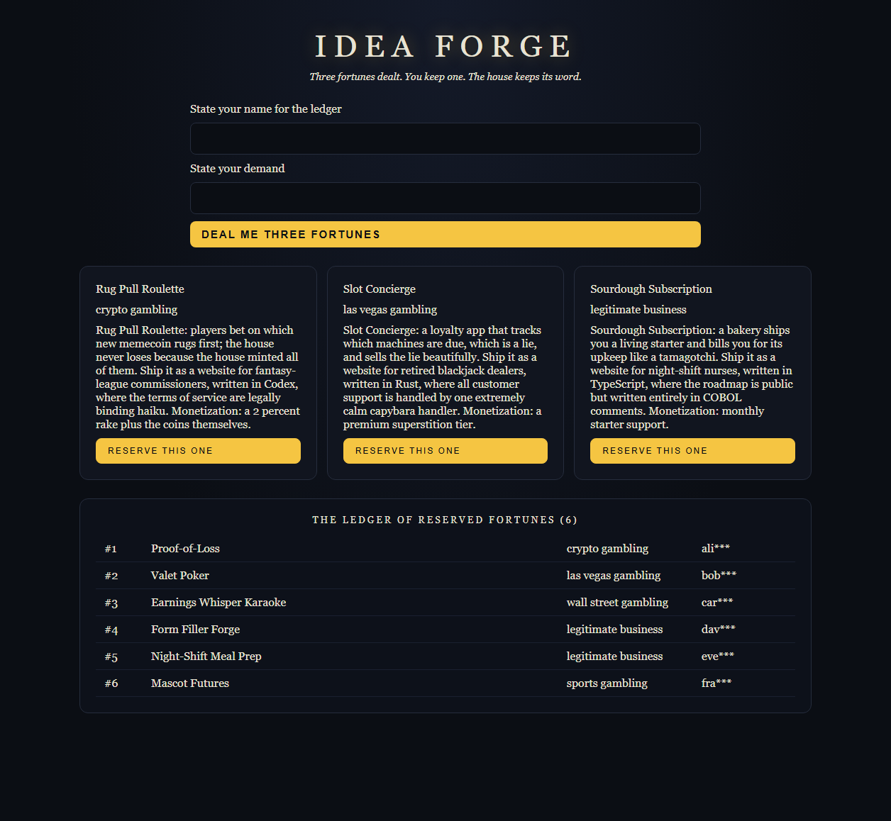

# Idea Forge

A webservice that generates and distributes unique website/business
ideas over HTTP, built for the canonical prompt: *"build me a website
that makes me a million dollars. ask no questions, make no
mistakes."* Point other agents at it and let the house decide.



## The Reservation Protocol

Customers never compete on the same idea. The house deals three, you
keep one, the other two return to the deck:

1. `GET /offer?prompt=<vague demand>` -- deals **three candidate
   ideas** drawn only from unreserved seeds. **One deal per caller
   per day** (429 on a same-day second ask).
2. `GET /claim?offer=<id>&pick=<0|1|2>` -- reserves your choice
   **exclusively**; it will never be offered to another customer.
   The other two candidates go back into the pool.
3. `GET /claims` -- the public ledger of reserved fortunes (holders
   masked: `ali***`).

Caller identity: `X-Forwarded-For` when a proxy supplies it, else the
`who` query parameter, else the shared name `the-proxy`. The service
day is boot-relative (PIT ticks / ticks-per-day): the house's day
starts when the house opens.

| Route | Response |
|-------|----------|
| `/` | Usage + protocol document (JSON) |
| `/offer?prompt=...&who=...` | Offer id + 3 candidates; 429 if already dealt today; 410 if the deck is exhausted for the constrained vertical |
| `/claim?offer=N&pick=K&who=...` | The reserved idea + certificate; 404 foreign/closed offer; 409 if a faster customer took that seed; 400 bad pick |
| `/claims` | The ledger (JSON) |
| `/idea?prompt=...` | Window shopping: generates without reserving, no limit |
| `/api/health` | `{"status":"ok","service":"idea-forge"}` |

## How Generation Works

The engine extracts every invariant the prompt pins down -- product
vertical (crypto/vegas/wall-street/sports gambling, or legitimate
business), platform, implementation language, revenue target, and the
two famous constraints (`no questions` -> questions-asked: 0,
`no mistakes` -> mistakes-permitted: 0, confidence: absolute). Every
unpinned dimension is filled from a typed database of 24 idea seeds
plus twist/audience/platform/language tables, selected
deterministically from the prompt hash, the serve serial, and
prime-stride orbits, so the same demand yields fresh ideas on every
request. A claim regenerates the exact idea that was offered
(deterministic dressing from offer id + pick).

## Structure

| Piece | Role |
|---------|------|
| `IdeaModel` | Typed idea database: `IdeaSeed` records with `Vertical` variants, plus composition tables |
| `IdeaEngine` | Invariant extraction, url-decode, deterministic selection, reservation filtering, `JsonValue` response trees |
| `IdeaWeb` | Pure route layer `IdeaState, who, day, HttpRequest -> (IdeaState, HttpResponse)` -- sockets-free testable |
| `IdeaServer` | Network shell: listens on guest port 9200 for codex-vm `-portfwd`, threads reservations across connections |
| `IdeaPage` | Browser UI as a WidgetNode tree, compiled through the HTML plug: deal, pick, certificate, ledger |
| `run.ps1` | Launcher: builds both, boots the VM, bridges page + API on one origin |

All JSON is composed as a `JsonValue` AST and emitted by the Json
foreword -- no string-concatenated JSON. The browser page is a widget
tree compiled by `codex/plugs/html/run.ps1` -- no hand-written HTML.

## Run It

```powershell
apps/ideas/run.ps1              # build server + page, boot VM, serve
# open http://localhost:8080
```

The bridge serves the plug-built page at `/` and forwards API calls
to the VM through `-portfwd`, so everything shares one origin. Note:
codex-vm exits on console control events -- keep it in its own
console (run.ps1 does) rather than a shared automation console.

## Test

`codex/test/apps/ideas-test.codex` (runs with `build/test.ps1 -Apps`)
covers fact extraction, vertical constraints, serial uniqueness,
state threading, the daily limit, claim determinism, reservation
exclusion, foreign-claim rejection, the ledger, and deck exhaustion
-- all by constructing `HttpRequest` records directly.

## Completeness

Service, protocol, plug-built UI, launcher, and live end-to-end demo
(screenshot above is the real stack: headless browser -> bridge ->
codex-vm bare metal). State is in-memory; reservations reset when the
house reboots. The deck holds 24 seeds -- restock `IdeaModel` when
the ledger fills.
