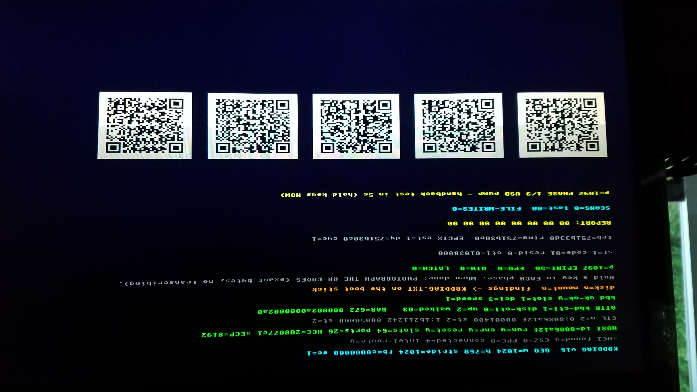
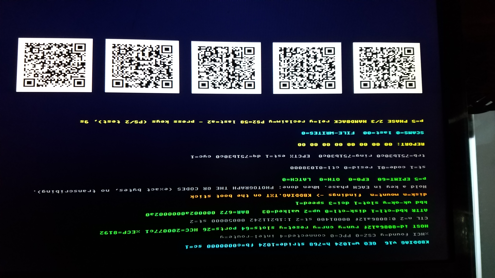
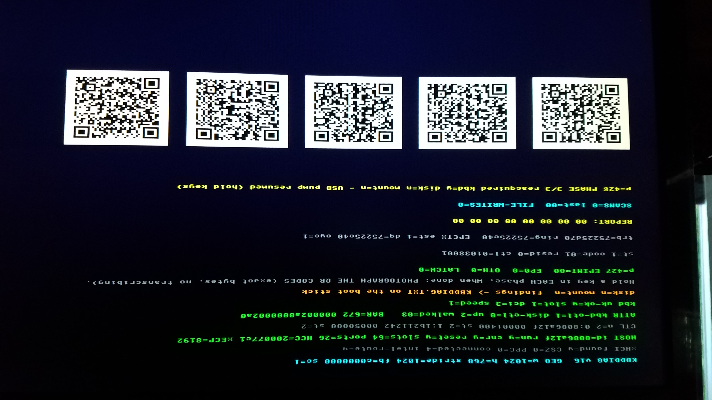

# The Hardware Bring-Up Playbook

**How to make real hardware work when the emulator says everything is
fine.** This is the method distilled from the ASUS TUF keyboard
campaign (sixteen probe versions, five metal boots, 2026-07-29 to
2026-08-03), written for the next person whose device enumerates
perfectly and then does nothing. The worked example is a USB keyboard,
but the method is the deliverable. The flyable artifact is
`build/boot/kbd-diag-v16.img` (digests in the root `README.md`); the
per-flight record is `docs/HardwareSitting.md`.

## The success record

Three photographs, one boot, under a minute -- the screen that ended
the campaign. The console is mounted inverted at this bench; upside
down photographs are normal here and cost nothing (see "Photograph
everything" below).

**Phase 1 -- the USB pump.** The driver owns the controller.
`EPINT=58` and climbing is the keyboard's interrupt pipe delivering
its idle heartbeats through our xHCI driver -- the line that stayed
`0` for fifteen versions:



**Phase 2 -- the ownership handback.** The driver halts the
controller and hands it back to the firmware; `PS2=58 last=a2` is
keystrokes arriving over the firmware's SMM PS/2 emulation, proving
the no-USB-driver fallback is real on this board:



**Phase 3 -- re-acquisition.** The full bring-up runs again inside
the same boot and the USB pipe delivers again (`EPINT` 60 to 80):
ownership can be juggled per phase, and nothing about the takeover is
one-shot luck:



## What was actually wrong, as a warning to the reader

The keyboard hardware was never broken. Three defects stacked, all
ours, none visible in an emulator that had been written to agree with
the driver:

1. **The driver sent HID `SET_IDLE` duration 0 at setup.** HID 1.11
   F.3 obliges a boot keyboard to send a report on EVERY interrupt
   poll by default; duration 0 is the one request that turns that off,
   and this keyboard honored it as "never report". The firmware never
   sends it, which is why BIOS setup always typed fine. The fix was
   deleting one call. The flight that proved it: `GET_IDLE` read back
   125 (x4 ms = 500 ms, the factory default) the moment we stopped
   zeroing it, and the pipe streamed.
2. **The diagnostic itself ran out of memory** (bare metal, no GC,
   text allocated on every repaint since v1) and its death photographed
   as a freeze. Rule 8 of `CLAUDE.md` names this exact pattern.
3. **The diagnostic's own Stop Endpoint experiment killed the pipe it
   had just proven alive** -- this Intel does not resume periodic
   delivery on a doorbell-restart after a Stop. Instruments must never
   touch a working device: gate every intrusive experiment on the
   symptom actually being present.

## The method

### 1. Put the authoritative spec in the tree before touching the subsystem

Every gap between the emulator and the metal traced to a model written
from what the driver expected instead of from the spec. The xHCI, USB
2.0, and HID 1.11 specifications now live in `docs/Reference/` as PDFs
with extracted `.txt` for Grep, and every claim derived from them
carries a section and page number
(`docs/Reference/xHCI_ServiceModel_Notes.md` is the worked example).
The standing rule earned by this campaign: **a test-bed arm is written
FROM a cited spec section, or it is not written.** An arm derived from
the driver can only ever agree with the driver.

### 2. Model the failure, not the success

The stock emulator keyboard always answers, so no emulator run could
ever reproduce a silent one. The breakthroughs came from arms that
model the pathology: `-hid-nak` (the keyboard that never answers,
matching the flight signature exactly) and `-hid-idle-quirk` (the
keyboard that over-honors SET_IDLE 0). The moment the metal's behavior
ran on the desk, every remaining bug was found in hours, not flights.
Flags and semantics: `docs/OperatorsManual.md` CLI table.

### 3. One instrument ladder, version-stamped, one change per version

The probe face carries its version (`KBDDIAG v16`) and the face is
frozen between versions -- a photograph is only evidence if you know
exactly which instrument took it. Each version changes as little as
possible over the last. Write the READING TABLE -- what each possible
value of each new row will mean -- into the run sheet BEFORE the
flight (`docs/HardwareSitting.md`, "Reading it" tables); if you cannot
say in advance what a reading would prove, the instrument is not ready
to fly.

### 4. Gate the exact file you flash

Different build arguments produce different artifacts; gate the FILE,
then hash it, and the digest is the provenance:

```powershell
python build/boot/validate-img.py           # GPT/FAT/PE structural check
pwsh build/boot/test-ovmf.ps1 -Img  ...     # boots under real edk2 firmware
tools/codex-vm.exe -kernel  -uefi -gop-width 1920 -gop-height 1080 `
    -gop-stride 2048 -screenshot <bmp> -screenshot-delay 60000   # bed render, ms
Get-FileHash  -Algorithm SHA256             # the identity that flies
```

Run the bed at the target's real geometry AND under
`-uefi-conout-remode` (the AMI console re-mode model) -- the display
corruption that opened this campaign was a stub reading GOP geometry
before the firmware's console re-moded it, and only the two-geometry
bed catches that class.

### 5. Flash with the canonical procedure, then PULL

One command, no wrapper scripts, log readable by a non-elevated
session; the full recipe and its reasoning live in
`docs/HardwareSitting.md`:

```powershell
Start-Process pwsh -Verb RunAs -PassThru -ArgumentList '-NoProfile','-File',
  '<repo>\build\flash-usb.ps1','-Image','<full path to img>',
  '-DiskNumber','N','-SpecFit','-Force','-Log','<repo>\build-output\flash.log'
```

The flasher writes, flushes, and verifies every byte plus the SpecFit
GPT sectors by readback. **Then pull the stick. Do not use Eject** --
Windows rewrites the partition table on eject and the firmware will
never list the stick (measured, documented in `flash-usb.ps1`'s
closing note).

### 6. Photograph everything; the QR codes are the exact bytes

A phone photograph of the glass is the data path home from a machine
with no working input or storage. The probe renders its findings twice:
human-readable rows, and QR codes carrying the same body byte-exact --
because a photo of text proves less than it seems (a dashed bar
photographs as solid; this campaign's L-GAP lesson), while a decoded QR
is transcription-proof. Hold a key in EACH phase. Photograph the rows
AND the codes, every phase, upside down or not.

### 7. Read one digit per flight, and let it kill a theory

Board time is the scarcest resource in the loop -- the human sits, the
desk does not. Every flight in the endgame was designed so a single
digit answered a question no emulator could: `est=1` (the controller
claims Running), `dq=<ring base>` (its true position never moved),
`f1=1a` (the TD was in progress -- the controller WAS polling, which
killed the best theory we had and pointed at the device). Expect your
best theory to die; the instrument that can only confirm you is not an
instrument (L-ORACLE).

## Where everything lives

| Artifact | Location |
|---|---|
| Flyable diagnostic image + digests | `build/boot/kbd-diag-v16.img`, root `README.md` |
| Per-flight run sheets and reading tables | `docs/HardwareSitting.md` |
| Emulator failure-model flags | `docs/OperatorsManual.md` (CLI table) |
| Spec PDFs + Grep text + cited derivations | `docs/Reference/` |
| Stick build and flash for end users | `docs/UsersHandbook.md` |
| The probe source (the instrument itself) | `build/boot/diag/KbdDiagProbe.codex` |
