# The Tailor's Fitting -- First Boot

A new machine is fitted, not configured. On its first boot from the
stick, Codex measures you, cuts an identity to fit, locks it under your
passphrase, and keeps the fitted garment on the stick itself. Every
boot after that is a return visit: the machine recognizes its owner,
asks for the passphrase, and unlocks the same identity it made.

This document walks the ceremony screen by screen, then the return
visit, then the day it ran on real hardware. Every screenshot is the
real surface: the bed shots come from codex-vm and OVMF rehearsals of
the flight image, and the closing photograph is the machine itself.

The ceremony lives in `apps/works/GopWizard.codex` (payload
`apps/works/GopBoot.codex`, image built by
`build/boot/build-option-a.ps1`). The crypto path is pinned headless by
`codex/test/apps/first-boot-ceremony`; flight records live in
`docs/HardwareSitting.md`.

## The fitting

### Welcome

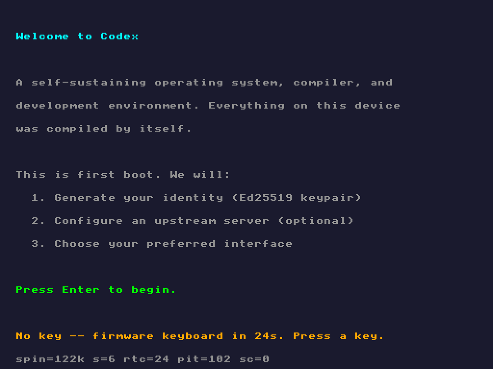

The first screen is also the keyboard proof gate: the one place the
boot stops and asks a human to press something. Any key proves the
keyboard delivers and holds the window open; thirty seconds of silence
hands the controller back to firmware, because a person who has not
touched a key in half a minute, on a screen that says "Press Enter to
begin", does not have a working keyboard. The bottom rows are the
gate's vitals -- the countdown, and the spin/RTC/PIT line that tells a
dead clock from a dead loop from a dead keyboard.

### The passphrase

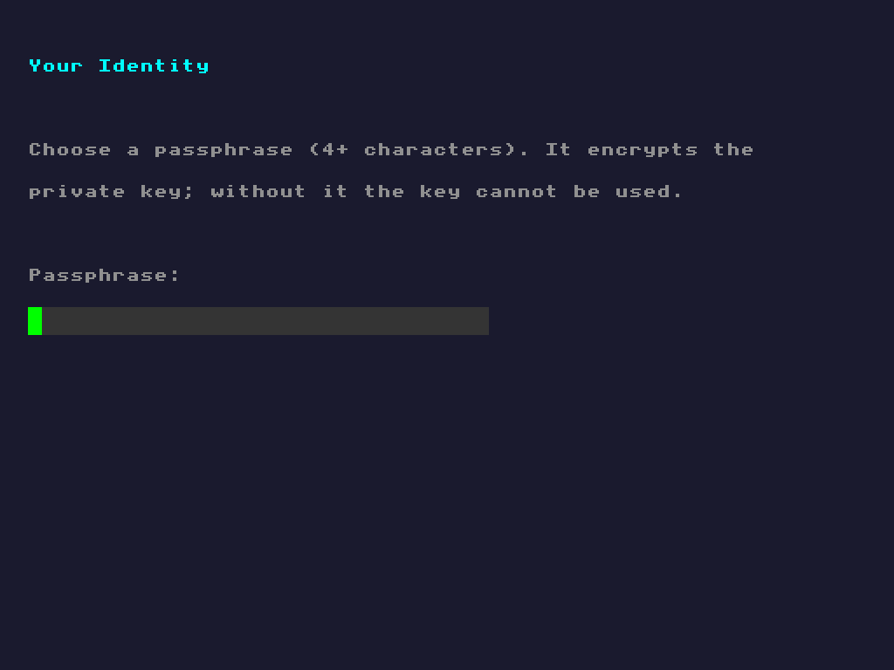

Two masked entries must match and reach four characters. The
passphrase never lands on disk: it becomes the key-wrapping key,
derived fresh each time it is needed.

### The measurement

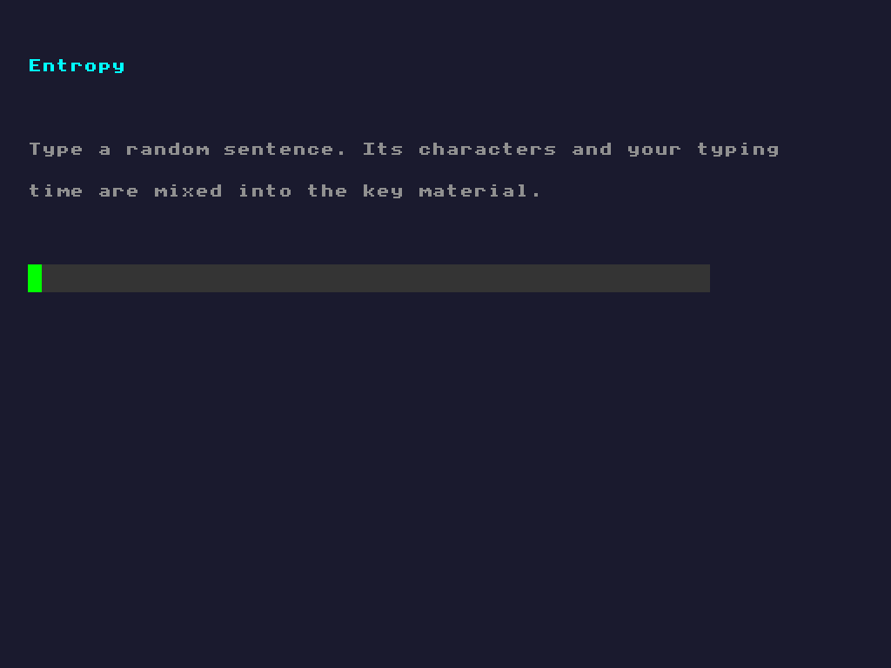

The random sentence is the measurement of the customer. Its characters,
the typing rhythm (timer ticks sampled after typing -- keystroke timing
the machine cannot predict), the device seed cell the boot stub fills
from RDRAND where the processor has it, and the passphrase all mix
through SHA-256 into the Ed25519 private seed.

### The upstream server

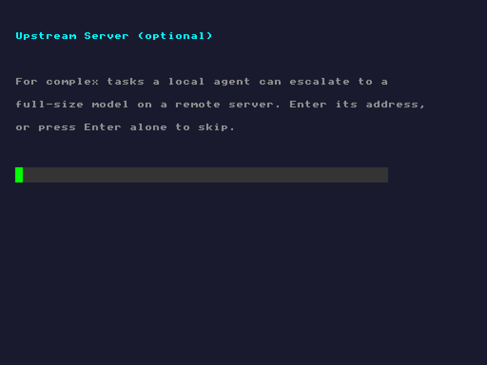

Optional. A local agent can escalate complex tasks to a full-size model
on a remote server; Enter alone skips it.

### Identity Created

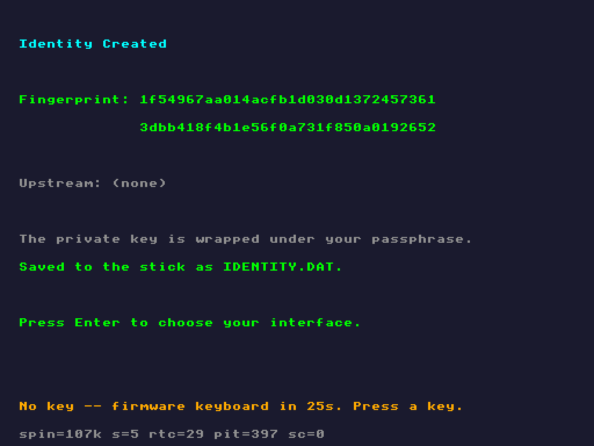

The suit is cut. The fingerprint is the SHA-256 of the Ed25519 public
key. The private seed is wrapped with AES-256-CBC under an HKDF key
derived from the passphrase and a fresh salt, and the whole identity is
serialized to the stick as `IDENTITY.DAT` -- a fixed, self-describing
record: `CIDN` magic, version, 16-byte salt, 16-byte IV, 32-byte public
key, then the wrapped seed with its length. 124 bytes for a version-1
record. Only the wrapped seed is secret, and it never leaves memory
unencrypted; what lands on disk is exactly what the wizard already
computed. The save row on this screen is a verdict: "Saved to the stick
as IDENTITY.DAT." means the write path through the machine's own disk
driver worked.

### Choose Interface

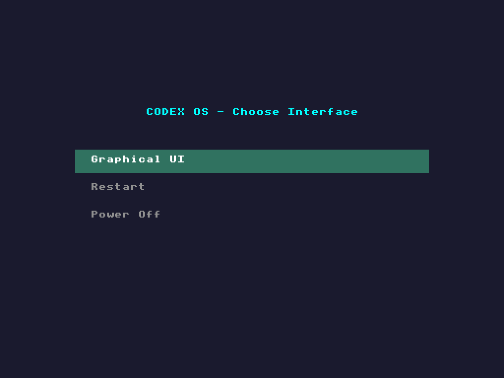

The menu offers only what works: Graphical UI (the default row -- a
plain Enter opens the desktop), Restart, and Power Off.

### The desktop

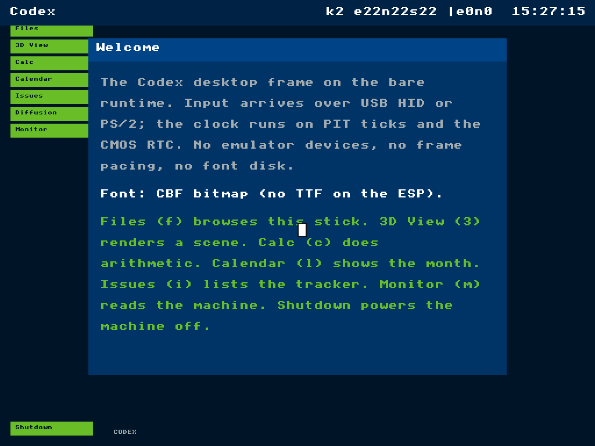

The Codex desktop frame on the bare runtime: input over USB HID or
PS/2, the clock on PIT ticks and the CMOS RTC, TrueType read back off
the stick's own ESP through our FAT16 driver.

## The return visit

### Welcome Back

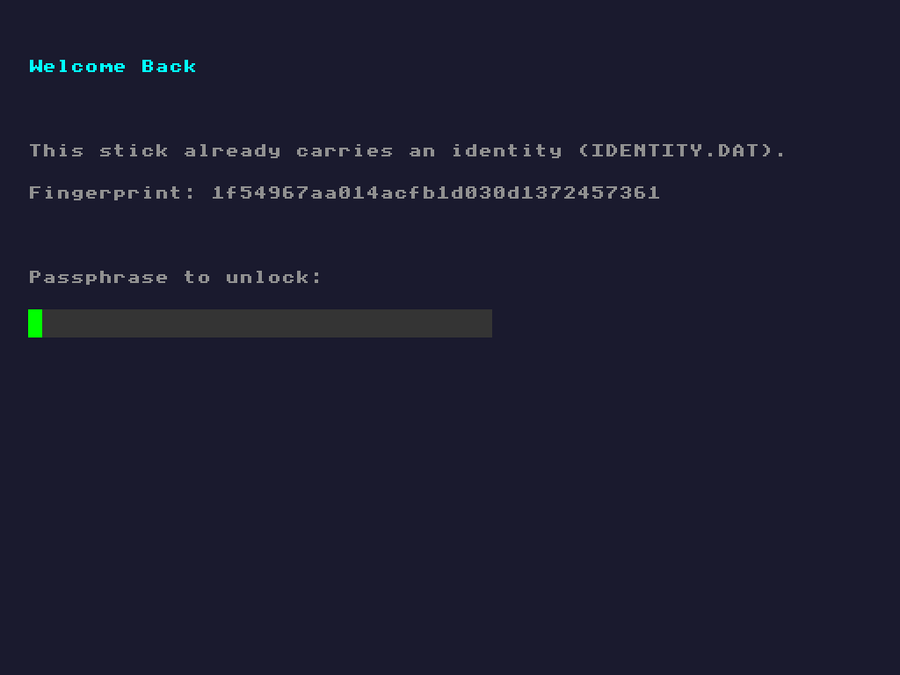

A stick that already carries an identity greets its owner by
fingerprint and asks for the passphrase. Underneath: mount the ESP,
read `IDENTITY.DAT`, validate the CIDN record, and prompt.

### Identity Unlocked

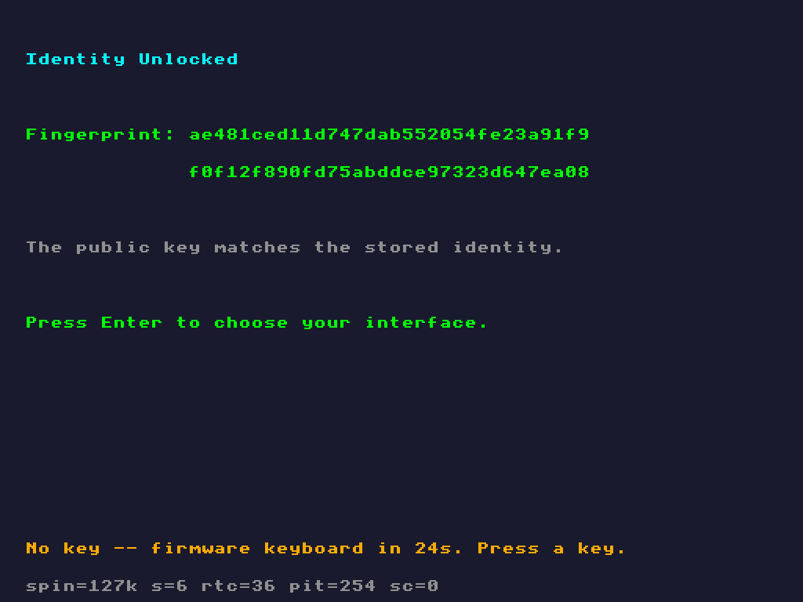

The unlock re-derives the HKDF key from the stored salt and the typed
passphrase, decrypts the wrapped seed, requires a 32-byte result, and
then re-derives the public key from that seed. Only if the re-derived
public key equals the stored one is the identity unlocked -- the
passphrase is never compared, the mathematics is.

### Identity Locked

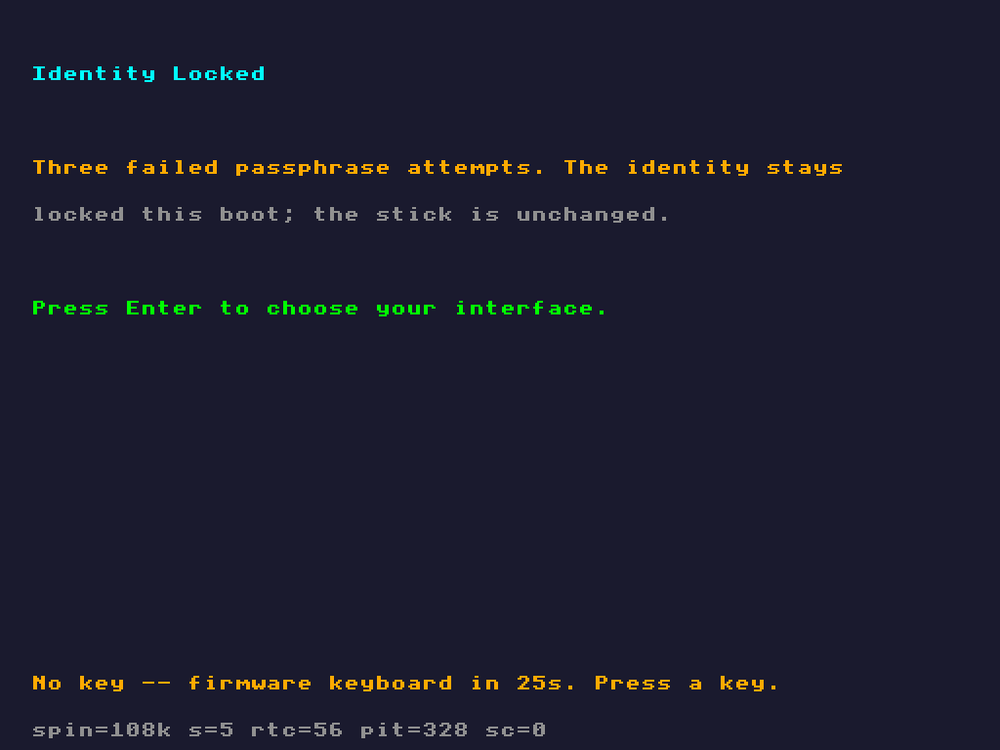

A wrong passphrase re-prompts with a warning. Three failures land
here: a named state, never a silent hang, and the stick is unchanged --
the identity is still there for a boot with the right passphrase. An
`IDENTITY.DAT` that cannot be read or parsed gets its own named screen
the same way.

## The day it ran on metal

2026-08-05. The flight image (`ceremonyboot.img`, seed
`52E0A3A00218E19F`) booted the ASUS TUF from the stick. The whole
ceremony was typed on the machine's own USB keyboard through our xHCI
and HID drivers; `IDENTITY.DAT` -- the same 124 bytes -- was written to
the stick's ESP through our USB mass-storage driver; the second boot
read it back, asked for the passphrase, and unlocked it. The F12 key
saved this photograph of the desktop to the stick, where it was
retrieved afterward:

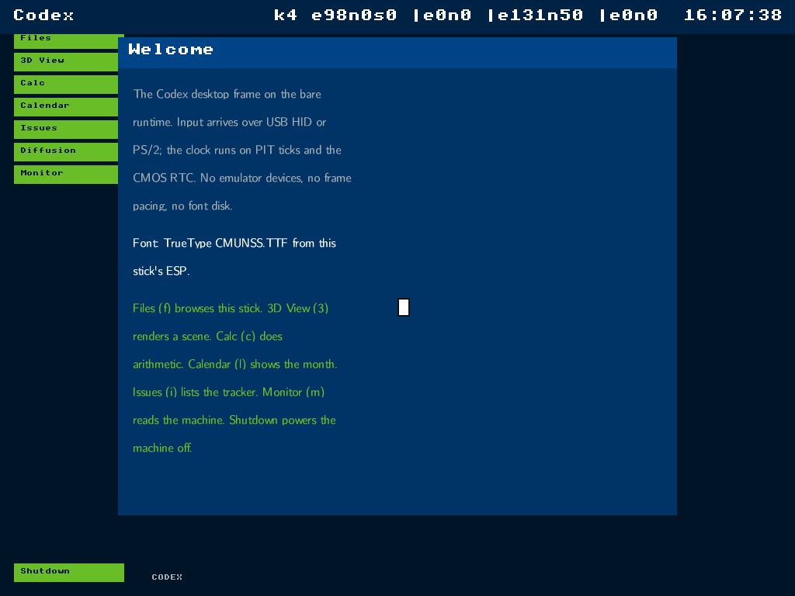

The top bar is live telemetry from the flight: `k4` -- four bound
keyboard-shaped interfaces on the bus; the per-interface `e`/`n`
counters showing which interface actually carried the keys; the RTC
clock at 16:07:38.
